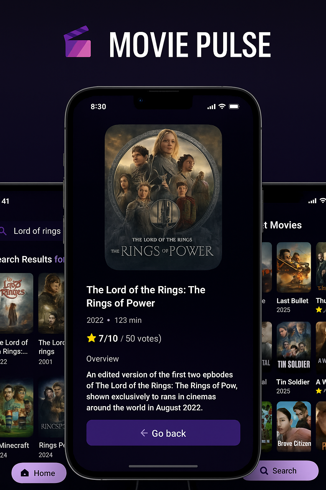

# Movie Pulse 🎬
<p align="center">
   
</p>

## Overview

**Movie Pulse** is a modern mobile app that lets users discover, search, and explore trending and popular movies. Built with React Native and Expo, it provides a visually appealing and intuitive interface for movie lovers to browse details, view trending titles, and keep track of their favorites.

---

## Features

- 🔍 **Search Movies:** Instantly search for movies by title and view detailed results.
- 📈 **Trending Movies:** See what’s popular right now, powered by real user search data.
- 📝 **Movie Details:** View comprehensive information including poster, title, release year, runtime, rating, genres, budget, revenue, and production companies.
- ⭐ **Save Favorites:** (Planned) Save your favorite movies for quick access.
- 🎨 **Modern UI:** Clean, responsive design with custom icons and images.
- ⚡ **Fast & Responsive:** Built with performance and smooth navigation in mind.

---

## Tech Stack

- **React Native** (with Expo)
- **TypeScript**
- **Expo Router** (for navigation)
- **NativeWind** (Tailwind CSS for React Native)
- **Appwrite** (for backend data and trending analytics)
- **TMDB API** (for movie data)

---

## Getting Started

1. **Clone the repository:**
   ```bash
   git clone https://github.com/your-username/movie-pulse-app.git
   cd movie-pulse-app
   ```

2. **Install dependencies:**
   ```bash
   npm install
   ```

3. **Set up environment variables:**
   - Copy `.env.example` to `.env` and fill in your TMDB and Appwrite credentials.

4. **Start the app:**
   ```bash
   npx expo start
   ```

---

## Folder Structure

```
app/            # App screens and navigation
components/     # Reusable UI components
constants/      # Images, icons, and static data
services/       # API and backend services
interfaces/     # TypeScript interfaces
types/          # Type definitions
```

---

## Contributing

Pull requests are welcome! For major changes, please open an issue first to discuss what you would like to change.

---

## Acknowledgements

- [TMDB](https://www.themoviedb.org/) for movie data API
- [Appwrite](https://appwrite.io/) for backend services
- [Expo](https://expo.dev/) for the React Native platform

---
